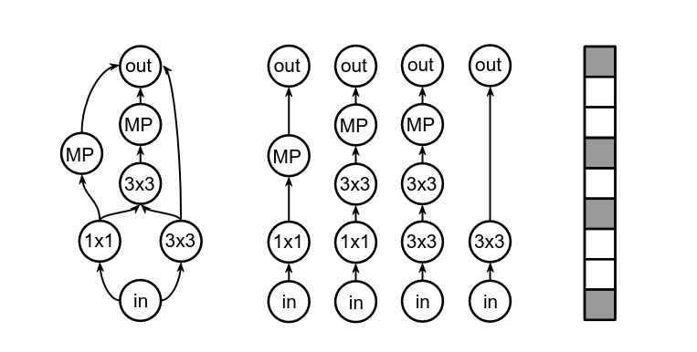
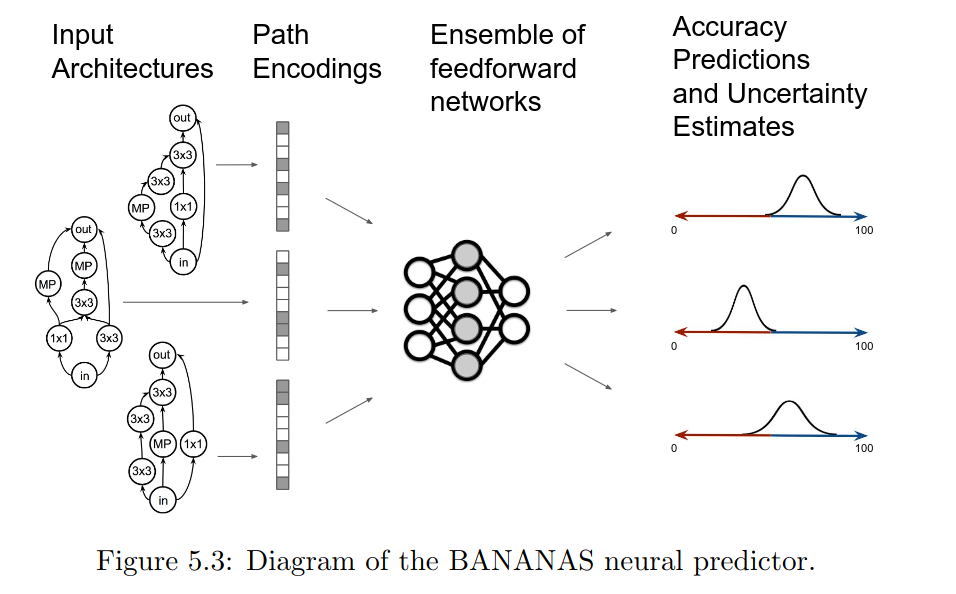
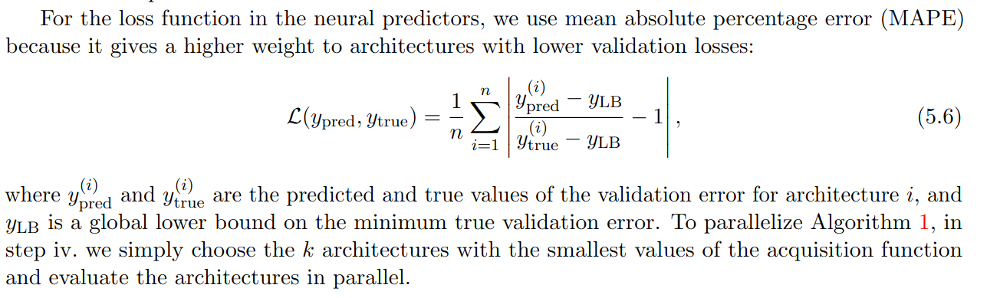

#  BANANAS / Bayesian Optimization for Neural Architecture Search (NAS)

## Source 

`https://github.com/naszilla/naszilla`:  Github with the code  
`https://arxiv.org/pdf/1910.11858`: Arxiv paper

---

##  Core Idea

Instead of training thousands of architectures:

 Learn a **surrogate model (predictor)**:

architecture → predicted performance

 Use it to **select  the most promising architectures and at the same time increase the predictor training set with the choose architectures**

---

##  Key Components

1. **Search Space**
   - Set of possible architectures (e.g., DAG cells)

2. **Encoding**
   - Architecture → vector representation ,  novelty in this approach - instead of confusing adjacency matrix , vector based unary representation (truncated/restricted to some length of the constituent elements 
     thus there is no bloating wwith which usually unary encoding struggles) 

   - (BANANAS uses **path-based encoding**)

   
   <!--  -->

3. **Predictor (Surrogate Model)**
   - ensemble of Neural networks trained on evaluated architectures (Different architectures tested by authors: GCNN , MLP ..)

   why ensamble? We need to estbalish some uncertaintiy for the Bayesian process ( we want to explore architecture with expected lowest error - but also with highest uncertainity, to broaden our knowledge)

4. **Uncertainty Estimation**
   - From ensemble variance

5. **Acquisition Function**
   - Scores how promising an architecture is

   *example of the acquisition function*
   EI(a) = E[max(0, y_min - f(a))]

   *we optimize it in the next step by calculating it's value for the neighbourhood architectures choosen as in the next point - We pick the one which maximizes this metric*

    Integral form:

   $∫_{-∞}^{y_min} (y_min - y) N(f̂, σ̂²) dy$

 Interpretation:
- improvement × probability

6. **Acquisition Optimization**
   - How we search the solution  space  (mutation-based in the paper) - we explore the localc mutation neighbouts(different operators can be defined), and like a local search we pick the ones that yields the highest value of the acquisition function from 
   the prediction
   - For the choosen one - we fully trian it, and add to the predictior training
   - this ends one iteration of the loop
   - nex iteration oof the loop is started 

---

##  Full NAS Loop

### 1. Initialize (cold start)
- Sample random architectures (e.g., 10–20)
- Train them → get real performance

$D = {(a₁, y₁), (a₂, y₂), ...}$

---

### 2. Train Predictor
- Train surrogate model :

$f(a) ≈ performance$

---

### 3. Generate Candidates (cheap)
- Mutate existing good architectures
- Produce many candidate  - uncertainty: σ̂
- Compute acquisition score

---

### 5. Select Top Candidates
- Pick a small batch (e.g., 5–10)

**Objective**

Select next architecture:

a_next = argmin φ(a)

- φ(a) = acquisition function

---

### 6. Train Selected Architecture/s (expensive)

  

- Train them fully (or partially)
- Get real validation error

### 7. Update Dataset for predictor training 

$D ← D ∪ {(a_new, y_new)}
$

---

### 8. Retrain Predictor
- Retrain (or fine-tune) on updated dataset

---

### 9. Repeat
- Loop steps 3–8

---

---

## Ensemble Setup

Given:
- Models: f₁(a), ..., f_M(a)

Compute:
$
f̂ = (1/M) Σ f_m(a)
σ̂ = std(f_m(a))
$

Also:

y_min = best observed error

---

##  Acquisition Functions

### 1. Expected Improvement (EI)

$
EI(a) = E[max(0, y_min - f(a))]

Integral form:

∫_{-∞}^{y_min} (y_min - y) N(f̂, σ̂²) dy
$

 Interpretation:
- improvement × probability

---

### 2. Probability of Improvement (PI)

$
PI(a) = P(f(a) < y_min)
$

 Only considers probability

---

### 3. Upper Confidence Bound (UCB)

$
UCB(a) = f̂ - β σ̂
$

- β controls exploration

---

### 4. Thompson Sampling (TS)

$
Pick m ~ Uniform(1, M)
TS(a) = f_m(a)
$

---

### 5. Independent Thompson Sampling (ITS) - Proved to perform the best, and resultantly used in the bananas 

$
ITS(a) ~ N(f̂, σ̂²)
$

---

## EI in Practice
### Monte Carlo approximation (common)

$
EI ≈ (1/M) Σ max(0, y_min - f_m(a))

This acquisition 
does not take the uncertainity into the consideration, only the expected improvement ased on the ensemble mean!
$

---

### Closed form (optional) -  interesting it values both the uncertainity and improvement 

###  Expected Improvement (Closed Form — Intuition)

formula 
$ z = (y_min - f̂) / σ̂ EI = (y_min - f̂) Φ(z) + σ̂ φ(z) $

We assume:

f(a) ~ N(f̂, σ̂²)

Define:

z = (y_min - f̂) / σ̂
we bring to the standard normal distirbution (0,1) and calculate the cdf  fpr the probability that result is lesser than y_min

f̂ ensemble mean for the currently examined architecture
y_min the minimum found so far 
sigma hat is deviation for the currently examined architecture

Then:

EI(a) = (y_min - f̂) Φ(z) + σ̂ φ(z)

---

###  Interpretation

- **Φ(z)** → probability that the architecture improves over current best  
- **(y_min - f̂)** → expected improvement based on mean prediction  
- **σ̂ φ(z)** → exploration bonus from uncertainty  

---

###  Intuition

EI balances:

 **Exploitation** → low predicted error (good mean)
-**Exploration** → high uncertainty (chance of surprise)

##  Key Insights

- Encoding quality is critical  
- Predictor quality > acquisition choice  
- Acquisition functions matter less than expected  
- ITS / TS perform well  
- Local search (mutation) is effective  

---

##  Final Takeaway

> You don’t eliminate training the architectures — you **minimize how often you need it thanks to the simpler surrogate models**
> The samples for the surrogate model are choosen smartly **thanks to bayesinaa process the surrogate mdoel explores the solution space in meaningfull way - not grid searhc like blindly**

BANANAS = efficient, guided exploration of architecture space

# Experimental results

##  Comparison of NAS Algorithms on DARTS Search Space

| NAS Algorithm        | Source | Avg. Test Error (%) | Runtime (GPU-days) | Method                         |
|---------------------|--------|---------------------|--------------------|--------------------------------|
| Random Search       | [35]   | 3.29                | 4                  | Random                         |
| Local Search        | [66]   | 3.49                | 11.8               | Local Search                   |
| DARTS               | [35]   | 2.76                | 5                  | Gradient-based                 |
| ASHA                | [30]   | 3.03                | 9                  | Successive Halving             |
| Random Search (WS)  | [30]   | 2.85                | 9.7                | Random + Weight Sharing        |
| DARTS (Ours)        | Ours   | 2.68                | 5                  | Gradient-based                 |
| ASHA (Ours)         | Ours   | 3.08                | 9                  | Successive Halving             |
| **BANANAS (Ours)**  | Ours   | **2.64**            | 11.8               | BO + Neural Predictor          |
 

 ## Experimental Conclusiosn **
 Seem to perform better than other arhcitectures, however the difference seem not to be very pronounce, however I haven't yet digged deeper into the evaluation part, thus I am not 
 entirely sure about  how it turns out in comparison
 

